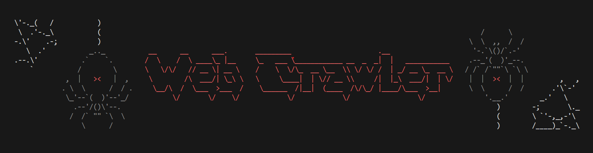

# Web Crawler

This program is a web crawler implemented in Go that performs a **breadth-first search** crawl of HTML documents on the world wide web. It uses **goroutines** to parallelize the crawling process significantly improving crawling speed. Each visited page can optionally be saved as a JSON file containing its URL and HTML content. The program generates a report listing the URL of each page crawled sorted by the number of links pointing to that page. 



## Features

- **Concurrent crawling**: specify number of goroutines used by crawler
- **Domain restriction**:  crawl only pages on a single domain
- **Configurable limits**: limit the number of pages crawled
- **Optional saving**: save crawled pages to disk in structured JSON format

## Flags

| Flag                  | Description                                                         |
| --------------------- | ------------------------------------------------------------------- |
| `--startURL string`   | **(Required)** The URL to start crawling from.                      |
| `--numGoroutines int` | Number of goroutines to spawn. Default is `3`.                      |
| `--maxPages int`      | Maximum number of pages to crawl. Default is `1000`.                |
| `--sameDomain`        | Restricts crawling to pages under the same domain as `startURL`.    |
| `--savePages`         | Saves each crawled page as a JSON file in the `./CORPUS` directory. |
| `--deletePrevPages`   | If set, deletes the `./CORPUS` directory from a previous crawl.     | 

## Directory Structure

When the `--savePages` flag is used, crawled pages are saved in the following structure:

```
./CORPUS/
├── example.com/
│   ├── 0c5b8b4b8e1db4d497b0ff6da2ce9441.json
│   └── ...
├── anotherdomain.org/
│   ├── 1cb2bfd1192fa19346c065cdabc28ae8.json
│   └── ...
```

- `./CORPUS/`: Root folder for all crawled content.
- Each subfolder is named after the **domain** of the crawled page
- Each JSON file within a domain folder is named using the **MD5 hash of the HTML content** for the corresponding page.

Each saved JSON file contains:

```json
{   
    "url": "https://example.com",   
    "content": "<html>...</html>" 
}
```

## Installation

You can install the program by running:

```bash
go install https://github.com/steven-rivera/web-crawler@lastest
```

Once installed, run:

```bash
web-crawler --startURL="https://example.com" --maxPages=10000 --numGoroutines=5 --savePages
```

with `https://example.com` replaced with your desired starting URL.

> [!NOTE]
> Requires Go 1.23+
